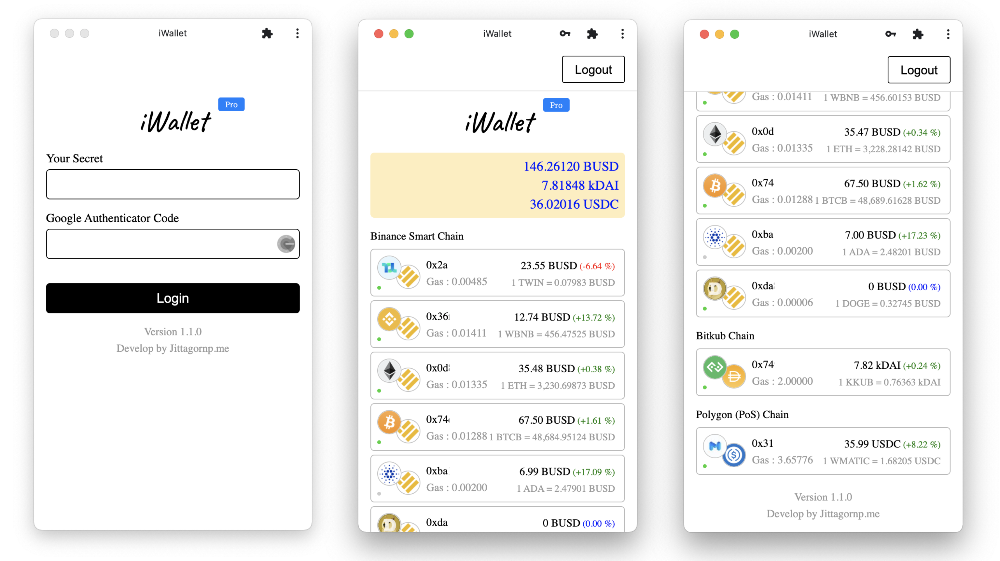
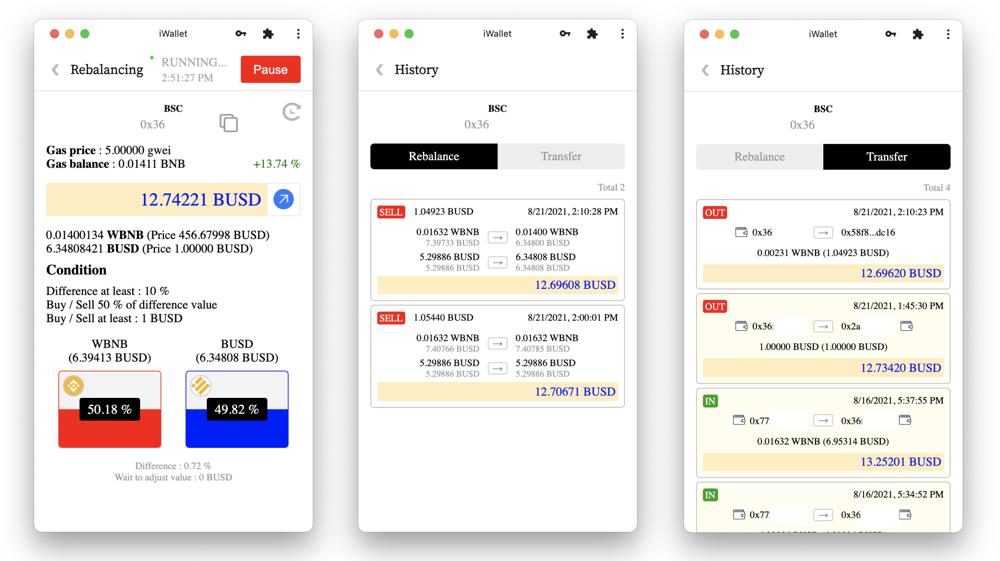
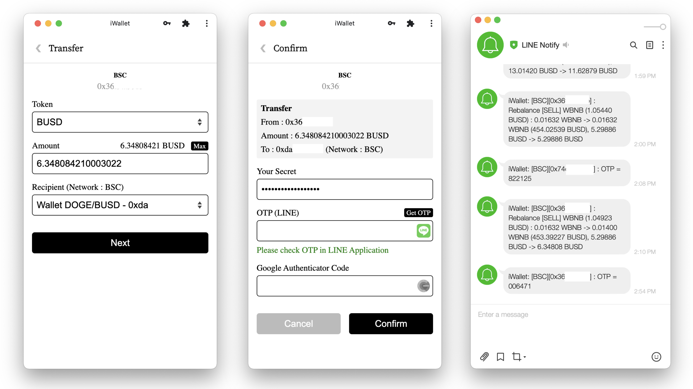

# iWallet Pro

> DeFi Portfolio Rebalancing - Pro







# Current version

> 1.1.0

# Features

| Feature | Free | Pro | 
|---------|-----|-----|
| Support multiple wallets. | :white_check_mark: | :white_check_mark: |
| Support multiple networks (BSC, Polygon, Bitkub). | :white_check_mark: | :white_check_mark: |
| Automated rebalancing (50:50) | :white_check_mark: | :white_check_mark: |
| Automated fill gas. | :white_check_mark: | :white_check_mark: |
| PWA (Progressive Web App), can install to Desktop and Mobile. | :white_check_mark: | :white_check_mark: |
| Support Two-Factor Authentication (2FA), Google Authenticator | :white_check_mark: | :white_check_mark: |
| Rebalancing History | :white_check_mark: | :white_check_mark: |
| Transfer History |  | :white_check_mark: |
| Know your Profit & Loss |  | :white_check_mark: |
| Transfer UI |  | :white_check_mark: |
| Line Notification |  | :white_check_mark: |

For free version : [https://hub.docker.com/r/jittagornp/iwallet](https://hub.docker.com/r/jittagornp/iwallet)

# How to install iWallet Pro

1. Export token to system environment variable.

```sh
$ export CR_PAT="<YOUR_TOKEN>"
```
**Remarks**  
CR_PAT = Container Registry Personal Access Token

2. Close and reopen the Terminal.

3. Login to GitHub Container Registry

```sh
$ echo $CR_PAT | docker login ghcr.io -u USERNAME --password-stdin
```

4. Pull iWallet image

```sh
$ docker pull ghcr.io/jittagornp/iwallet
```

# Update to latest version

```sh
$ docker pull ghcr.io/jittagornp/iwallet
```

# Generate wallet

```sh
$ docker run --rm -v $PWD:/iwallet ghcr.io/jittagornp/iwallet wallet-gen -p <YOUR_WALLET_PASSWORD> -n <NETWORK>
```
Example

```sh
$ docker run --rm -v $PWD:/iwallet ghcr.io/jittagornp/iwallet wallet-gen -p 123456 -n POLYGON_MAINNET

Generating wallet and config...
Output wallet file "0x7fe5999fd513deae43d19dd0ab3cce8491ed6440.wallet.json"
Output config file "0x7fe5999fd513deae43d19dd0ab3cce8491ed6440.config.json"

$ cat 0x7fe5999fd513deae43d19dd0ab3cce8491ed6440.config.json
{
  "walletFile" : "0x7fe5999fd513deae43d19dd0ab3cce8491ed6440.wallet.json",
  "walletPassword" : "123456",
  "network" : "POLYGON_MAINNET",
  "tokenA" : "0x0d500b1d8e8ef31e21c99d1db9a6444d3adf1270", //WMATIC
  "tokenB" : "0x2791bca1f2de4661ed88a30c99a7a9449aa84174", //USDC
  "minimumGasBalance" : 0.01,
  "fillGasTokenBAmount" : 3,
  "swapRouter" : "0xa5e0829caced8ffdd4de3c43696c57f7d7a678ff", //Quickswap Router
  "gasSwapRouter" : "0xa5e0829caced8ffdd4de3c43696c57f7d7a678ff", //Quickswap Router
  "defaultSwapSlippage" : 0.5,
  "defaultSwapDeadlineMinutes" : 10,
  "tokenAutoApproveNTimes" : 3.0,
  "differenceAtLeastPercent" : 10.0,
  "swapPercent" : 50.0,
  "swapAtLeastValue" : 1,
  "recipientWhitelist" : []
}
```

# Run iWallet Pro

```sh
$ docker run -d \
  -p 8080:8080 \
  -v $PWD:/iwallet \
  -e IWALLET_DATABASE_USERNAME="<YOUR_DATABASE_USERNAME>" \
  -e IWALLET_DATABASE_PASSWORD="<YOUR_DATABASE_PASSWORD>" \
  -e IWALLET_APP_SECRET="<YOUR_APP_SECRET>" \
  -e IWALLET_ALLOW_DOMAINS="<YOUR_DOMAIN_NAME>"
  -e IWALLET_GOOGLEAUTH_SECRET_KEY="<YOUR_GOOGLEAUTH_SECRET_KEY>" \
  -e IWALLET_LINE_NOTIFY_TOKEN="<YOUR_LINE_NOTIFY_TOKEN>" \
  --restart=always \
  --name iwallet ghcr.io/jittagornp/iwallet
```

# Transfer 

> Config recipient whitelist
 
For `*.config.json` 

```js
{
  
  ...
  ...
  
  "recipientWhitelist" : [
     {
        "name" : "Wallet 1",
        "address" : "0x1111111111111111111111111111111111111111"
     },
     {
        "name" : "Wallet 2",
        "address" : "0x2222222222222222222222222222222222222222"
     },
     {
        "name" : "Wallet 3",
        "address" : "0x3333333333333333333333333333333333333333"
     }
  ]
}
```

Example

```js
{
  "walletFile" : "0x7fe5999fd513deae43d19dd0ab3cce8491ed6440.wallet.json",
  "walletPassword" : "123456",
  "network" : "POLYGON_MAINNET",
  "tokenA" : "0x0d500b1d8e8ef31e21c99d1db9a6444d3adf1270", //WMATIC
  "tokenB" : "0x2791bca1f2de4661ed88a30c99a7a9449aa84174", //USDC
  "minimumGasBalance" : 0.01,
  "fillGasTokenBAmount" : 3,
  "swapRouter" : "0xa5e0829caced8ffdd4de3c43696c57f7d7a678ff", //Quickswap Router
  "gasSwapRouter" : "0xa5e0829caced8ffdd4de3c43696c57f7d7a678ff", //Quickswap Router
  "defaultSwapSlippage" : 0.5,
  "defaultSwapDeadlineMinutes" : 10,
  "tokenAutoApproveNTimes" : 3.0,
  "differenceAtLeastPercent" : 10.0,
  "swapPercent" : 50.0,
  "swapAtLeastValue" : 1,
  "recipientWhitelist" : [
    {
      "name" : "MetaMask",
      "address" : "0x22203d22226d34D333333333C65Ad7ADa2111111"
    }  
  ]
}
```

# See more

- [https://hub.docker.com/r/jittagornp/iwallet](https://hub.docker.com/r/jittagornp/iwallet)
